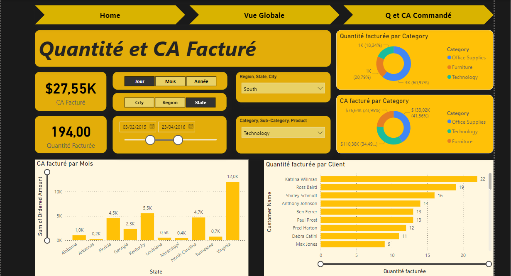

# Sales Dashboard with Power BI

This project involves the creation of an interactive sales dashboard using **Power BI** to visualize sales data. The dashboard allows users to track key performance indicators (KPIs) such as ordered and invoiced quantities, amounts, and profits. It also provides insights into sales performance through various visualizations such as bar charts, area charts, and KPIs.

## Features

- **Sales KPIs**: Display key metrics such as total amount, quantity sold, and total profit.
- **Data Visualizations**: Interactive bar charts, area charts, and other visual components to track sales trends over time.
- **Data Relationships**: Use of a **Calendar Table** to establish relationships with sales data for accurate time-based analysis.
- **Power Query ETL**: Efficient data transformation and loading using **Power Query**.
- **DAX Calculations**: Advanced DAX formulas to calculate key metrics and performance indicators.

## Technologies Used

- **Power BI**: For data visualization and dashboard creation.
- **DAX**: For calculating advanced metrics such as total amount, quantity, and profit.
- **Power Query**: For extracting, transforming, and loading (ETL) the data.
- **Excel**: For initial data preparation and as a data source in some cases.
  
## Dashboard Overview

The dashboard is designed to provide an intuitive interface for tracking sales performance. It includes the following components:

- **KPIs**: Display of key sales metrics like total sales, total quantity, and profit.
- **Bar Charts**: Visual representation of sales performance by categories such as region, product, or time period.
- **Area Charts**: Trend analysis of sales over time, allowing users to see how sales quantities and amounts have changed.
- **Date Relationships**: A Calendar table is used to link sales data with date dimensions, enabling time-based analysis.

## ETL Process

The ETL process is handled using **Power Query** to clean and transform raw data into a format suitable for analysis. Key steps include:

1. **Extract**: Import data from various sources (Excel, CSV, etc.).
2. **Transform**: Clean and reshape data using Power Query's transformation capabilities.
3. **Load**: Load the transformed data into Power BI for visualization.

## DAX Calculations

DAX (Data Analysis Expressions) is used to calculate key metrics such as:

- **Total Amount**: Sum of all sales amounts.
- **Total Quantity**: Sum of all ordered quantities.
- **Total Profit**: Profit calculated as the difference between the total sales amount and cost.

## Installation

1. Clone this repository to your local machine.
2. Open the Power BI file (`.pbix`) in Power BI Desktop.
3. If necessary, update data sources in Power Query.
4. Refresh the data and view the dashboard.

## Screenshot of a Dashboard page

> *Replace `path_to_image.png` with the actual path to your image file.*

## License

This project is licensed under the Apache License - see the [LICENSE](LICENSE) file for details.

## Acknowledgements

- Power BI Documentation: [https://docs.microsoft.com/en-us/power-bi/](https://docs.microsoft.com/en-us/power-bi/)
- DAX Documentation: [https://docs.microsoft.com/en-us/dax/](https://docs.microsoft.com/en-us/dax/)
- Power Query Documentation: [https://docs.microsoft.com/en-us/power-query/](https://docs.microsoft.com/en-us/power-query/)
